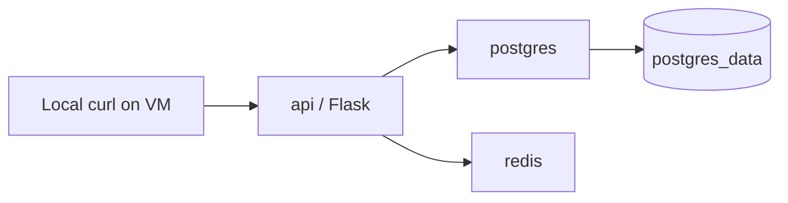

# Compose API Stack 🧩

## 🎯 Что это за проект

`compose-api-stack` — учебный Day 4 проект для 30-дневного DevOps portfolio.

Он показывает multi-container Docker Compose stack:

- Flask API;
- PostgreSQL database;
- Redis cache;
- healthchecks;
- безопасный localhost port binding.

## 🏗️ Architecture



API доступен только на host loopback:

```yaml
ports:
  - "127.0.0.1:5000:5000"
```

## 📦 Services

| Service | Container | Image / build | Purpose | Port |
|---|---|---|---|---|
| `api` | `compose-api` | Local Dockerfile | Flask API | `127.0.0.1:5000` |
| `postgres` | `compose-postgres` | `postgres:16-alpine` | Database | Not published |
| `redis` | `compose-redis` | `redis:7-alpine` | Cache / counter | Not published |

## 🌐 Endpoints

| Method | Path | Purpose |
|---|---|---|
| `GET` | `/` | API message and service list |
| `GET` | `/healthz` | Healthcheck endpoint |
| `GET` | `/redis` | Increment Redis counter |
| `GET` | `/db` | Return PostgreSQL version |

## ▶️ How to run locally/server

```bash
cd apps/compose-api-stack
docker compose up -d --build
docker compose ps
```

На Oracle VM проект запускался из:

```bash
cd ~/compose-api-stack
docker compose up -d --build
docker compose ps
```

## 🔍 How to verify

```bash
curl http://localhost:5000/
curl http://localhost:5000/healthz
curl http://localhost:5000/redis
curl http://localhost:5000/db
```

Expected examples:

```json
{"message":"Hello from Docker Compose API stack","services":["api","postgres","redis"]}
```

```json
{"status":"ok"}
```

```json
{"redis_hits":"1"}
```

```json
{"postgres_version":"PostgreSQL 16.13 on aarch64-unknown-linux-musl, compiled by gcc (Alpine 15.2.0) 15.2.0, 64-bit"}
```

## 📜 How to check logs

```bash
docker compose logs --tail=30 api
docker compose logs --tail=30 postgres
docker compose logs --tail=30 redis
```

## 🛑 How to stop

Stop containers and keep PostgreSQL volume:

```bash
docker compose down
```

Stop containers and remove PostgreSQL volume:

```bash
docker compose down -v
```

## 🔐 Security notes

- API host port is bound to `127.0.0.1:5000`.
- PostgreSQL `5432` is not published to the host.
- Redis `6379` is not published to the host.
- `.env` must not be committed.
- `.env.example` is safe as a template.
- Public access should be opened only intentionally.

## 🧯 Troubleshooting

| Symptom | Cause | Fix |
|---|---|---|
| `curl: (56) Recv failure` | API still starting | Wait 1-2 seconds, check `docker compose ps`, retry |
| Redis memory overcommit warning | Host sysctl setting | Set `vm.overcommit_memory = 1` and run `sudo sysctl --system` |
| `0.0.0.0:5000->5000/tcp` | Port bound to all interfaces | Use `127.0.0.1:5000:5000` |
