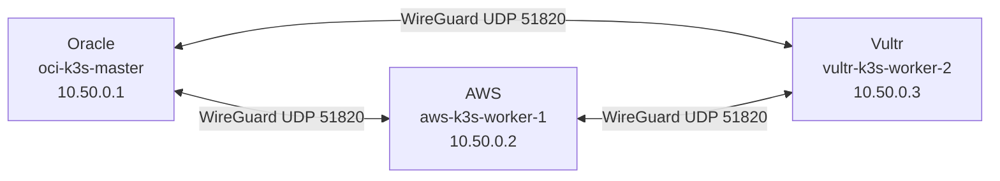
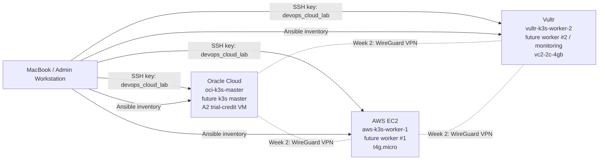

# Architecture

## 🧭 Current Week 1 Architecture

Week 1 produced a secured multi-cloud foundation. The current setup is intentionally minimal:

- MacBook / Admin Workstation manages Git, SSH, Terraform, Ansible, and documentation.
- Oracle Cloud node is prepared as the future k3s master.
- AWS EC2 node is prepared as future worker #1.
- Vultr node is prepared as future worker #2 / monitoring node.
- Ansible connectivity to all 3 nodes is verified.
- k3s is not installed yet.

Real public IPs are not committed. Public docs use placeholders only.

## ✅ Week 2 / Day 8 VPN Architecture

Day 8 added a private WireGuard mesh between the cloud nodes. This VPN layer will be used by k3s so master/worker communication can happen over private VPN IPs instead of public interfaces.

VPN results:

- WireGuard handshakes verified between all nodes.
- VPN ping tests passed with `0% packet loss`.
- Kubernetes API `6443/tcp` is still not opened publicly.
- All nodes stopped after verification to control costs.

## 🔮 Future Week 2 Architecture

Week 2 will add:

- k3s master on Oracle using VPN IP `10.50.0.1`.
- AWS and Vultr joined as k3s workers.
- Kubernetes API access through VPN or SSH tunnel only.
- No public Kubernetes API exposure.

## 🗺️ Diagram

## 📌 Current Nodes

| Node | Cloud | Role | Public IP | VPN IP | Status |
|---|---|---|---|---|---|
| `oci-k3s-master` | Oracle Cloud | future k3s master | `<ORACLE_PUBLIC_IP>` | `10.50.0.1` | stopped |
| `aws-k3s-worker-1` | AWS EC2 | future k3s worker #1 | `<AWS_PUBLIC_IP>` | `10.50.0.2` | stopped |
| `vultr-k3s-worker-2` | Vultr | future k3s worker #2 / monitoring | `<VULTR_PUBLIC_IP>` | `10.50.0.3` | stopped |

## 🔐 Public Documentation Rules

- Real public IPs are stored only in private local inventory.
- Public docs use `<ORACLE_PUBLIC_IP>`, `<AWS_PUBLIC_IP>`, and `<VULTR_PUBLIC_IP>`.
- Private inventory is not committed.
- WireGuard VPN is completed with placeholders in public docs.
- k3s is not installed yet.
- Day 9 will add k3s master on Oracle over `10.50.0.1`.
