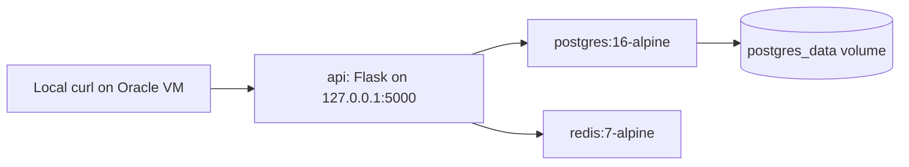

# Day 4 — Docker Compose Stack 🧩

## 🎯 Цель дня

Создать multi-container stack через Docker Compose на Oracle VM:

- Flask API service;
- PostgreSQL database;
- Redis cache;
- healthchecks для всех сервисов;
- безопасный локальный port binding для API.

Day 4 продолжает Day 3: после одиночных Docker containers был собран первый связанный application stack, похожий на минимальную production-схему `app + database + cache`.

## 🧱 Контекст инфраструктуры

| Поле | Значение |
|---|---|
| Cloud | Oracle Cloud Infrastructure |
| Region | `<ORACLE_REGION>` |
| Hostname | `oci-k3s-master` |
| OS | Ubuntu `24.04.4 LTS` |
| Architecture | `arm64` |
| Shape | `VM.Standard.A2.Flex` |
| Role | Future `k3s` master node |
| Public IP | `<ORACLE_PUBLIC_IP>` |
| Payment source | Oracle trial credits / Universal Credits |
| Resource type | Paid trial-credit resource, not Always Free |

## 🏗️ Архитектура stack



Публичный доступ к API не открывался. Проверки выполнялись через `localhost` внутри VM.

## 📦 Сервисы

| Service | Container | Image / build | Port exposure | Purpose |
|---|---|---|---|---|
| `api` | `compose-api` | `build: .` | `127.0.0.1:5000:5000` | Flask API |
| `postgres` | `compose-postgres` | `postgres:16-alpine` | Not published | Database |
| `redis` | `compose-redis` | `redis:7-alpine` | Not published | Cache / counter |

## 🌐 API endpoints

| Method | Path | Назначение | Ожидаемый результат |
|---|---|---|---|
| `GET` | `/` | Проверка API и списка сервисов | `{"message":"Hello from Docker Compose API stack","services":["api","postgres","redis"]}` |
| `GET` | `/healthz` | Health endpoint для Compose healthcheck | `{"status":"ok"}` |
| `GET` | `/redis` | Проверка Redis counter | `{"redis_hits":"1"}`, затем `{"redis_hits":"2"}` |
| `GET` | `/db` | Проверка PostgreSQL connection | PostgreSQL version string |

## 🧾 Структура проекта

```text
apps/compose-api-stack/
├── .dockerignore
├── .env.example
├── Dockerfile
├── README.md
├── compose.yaml
└── app/
    ├── app.py
    └── requirements.txt
```

## ⚙️ compose.yaml

Ключевые решения:

- `api` собирается из локального `Dockerfile`;
- `api` публикует порт только на `127.0.0.1`;
- `postgres` и `redis` не публикуют host ports;
- `api` стартует после healthy `postgres` и `redis`;
- `postgres_data` volume хранит данные PostgreSQL;
- каждый сервис имеет healthcheck.

Безопасный port binding:

```yaml
ports:
  - "127.0.0.1:5000:5000"
```

## ✅ Healthchecks

| Service | Healthcheck | Purpose |
|---|---|---|
| `api` | `http://localhost:5000/healthz` | Проверить, что Flask отвечает |
| `postgres` | `pg_isready -U appuser -d appdb` | Проверить готовность PostgreSQL |
| `redis` | `redis-cli ping` | Проверить готовность Redis |

## 🚚 Передача проекта на сервер

Проект был отправлен с Mac на Oracle VM через `rsync`:

```bash
rsync -avz -e "ssh -i ~/.ssh/devops_cloud_lab" \
  ~/devops-portfolio/apps/compose-api-stack/ \
  ubuntu@<ORACLE_PUBLIC_IP>:~/compose-api-stack/
```

## ▶️ Запуск stack

На Oracle VM:

```bash
cd ~/compose-api-stack
docker compose up -d --build
docker compose ps
```

## 🔍 Проверки через curl

```bash
curl http://localhost:5000/
curl http://localhost:5000/healthz
curl http://localhost:5000/redis
curl http://localhost:5000/redis
curl http://localhost:5000/db
```

Успешные ответы:

```json
{"message":"Hello from Docker Compose API stack","services":["api","postgres","redis"]}
```

```json
{"status":"ok"}
```

```json
{"redis_hits":"1"}
```

```json
{"redis_hits":"2"}
```

```json
{"postgres_version":"PostgreSQL 16.13 on aarch64-unknown-linux-musl, compiled by gcc (Alpine 15.2.0) 15.2.0, 64-bit"}
```

## 📊 Финальный docker compose ps

| Container | State | Health | Ports |
|---|---|---|---|
| `compose-api` | Up | healthy | `127.0.0.1:5000->5000/tcp` |
| `compose-postgres` | Up | healthy | `5432/tcp` |
| `compose-redis` | Up | healthy | `6379/tcp` |

## 🧯 Ошибки и решения

| Symptom | Cause | Fix |
|---|---|---|
| `curl: (56) Recv failure: Connection reset by peer` | API container был `health: starting`, Flask еще не принимал запросы | Подождать 1-2 секунды, повторить `curl`, проверить `docker compose ps` и logs |
| `WARNING Memory overcommit must be enabled!` в Redis | Linux kernel setting не подходил для Redis | Добавить `vm.overcommit_memory = 1` и применить `sudo sysctl --system` |
| `0.0.0.0:5000->5000/tcp` | Port binding открыт на всех interfaces | Использовать `127.0.0.1:5000:5000` |

## 🔐 Security notes

- API bound only to `127.0.0.1:5000`.
- PostgreSQL port `5432` не опубликован наружу.
- Redis port `6379` не опубликован наружу.
- Oracle Security List не открывала `5000`, `5432`, `6379`.
- UFW не открывал эти порты.
- Проверка шла через `localhost` внутри VM.
- `.env` не коммитится.
- `.env.example` можно коммитить как безопасный template.
- Реальные public IP, email, OCID, billing/subscription/account details не фиксируются в публичных docs.

## 💳 Cost notes

- VM `oci-k3s-master` использует Oracle trial credits / Universal Credits.
- Shape `VM.Standard.A2.Flex` не считается Always Free resource.
- Для этой lab важно продолжать daily billing checks.
- Public docs должны использовать `<ORACLE_REGION>` и `<ORACLE_PUBLIC_IP>`.

## 🧹 Cleanup

Остановить stack:

```bash
docker compose down
```

Остановить stack и удалить PostgreSQL volume:

```bash
docker compose down -v
```

Для портфолио `postgres_data` можно оставить на время экспериментов.

## ✅ Final checklist

- [x] Multi-container Compose stack создан.
- [x] Flask API работает.
- [x] PostgreSQL отвечает через `/db`.
- [x] Redis counter работает через `/redis`.
- [x] Все сервисы healthy.
- [x] API port bound to `127.0.0.1`.
- [x] DB/cache ports не опубликованы наружу.
- [x] Redis memory overcommit warning исправлен.
- [x] Troubleshooting задокументирован.

## 🔜 Next steps для Day 5

- Подготовить AWS и Vultr VM creation flow.
- Сохранять cost controls и placeholders в публичной документации.
- Не открывать public ports без явной причины.
