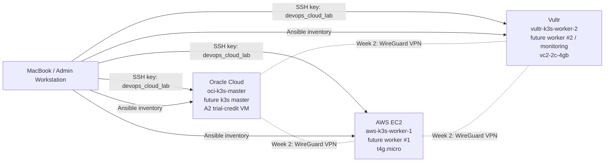

# Week 1 Review — Infrastructure Setup + Docker Basics

## 🎯 Цель недели

Week 1 закрывает базовый фундамент для 30-дневного DevOps portfolio: аккаунты, billing safety, GitHub repo, SSH hardening, первая cloud VM, Docker, Docker Compose, multi-cloud workers, Terraform/Ansible skeleton и проверка Ansible connectivity.

Kubernetes/k3s пока не установлен. Week 1 подготавливает безопасную и задокументированную основу для Week 2.

## ✅ Summary

К концу Week 1 готово:

- Multi-cloud account/billing/security baseline.
- GitHub portfolio repo: `devops-30-day-portfolio`.
- Oracle master VM baseline.
- Docker installed and tested.
- Docker Compose app stack.
- AWS worker VM baseline.
- Vultr worker VM baseline.
- Terraform skeleton.
- Ansible skeleton.
- Working Ansible connectivity to all 3 cloud nodes.
- Все 3 cloud nodes stopped after verification.

## 📅 Day-by-Day Recap

| Day | Topic | Result |
|---|---|---|
| Day 1 | Accounts, Billing Safety, Git Foundation | Cloud accounts checked, MFA/budgets enabled, GitHub repo created |
| Day 2 | Oracle VM Baseline | Oracle `oci-k3s-master` created and hardened |
| Day 3 | Docker Basics | Docker installed, demo image built and tested |
| Day 4 | Docker Compose Stack | Flask + PostgreSQL + Redis stack created and tested |
| Day 5 | AWS + Vultr VM Creation | AWS and Vultr worker nodes created and hardened |
| Day 6 | Terraform + Ansible Skeleton | IaC skeleton created, Ansible ping 3/3 successful |
| Day 7 | Week 1 Review + Documentation | Week 1 reviewed, summary docs created |

## 🏆 Key Achievements

- GitHub portfolio repo created and pushed.
- Public documentation structure established.
- Oracle VM baseline completed with SSH hardening.
- Docker Engine and Docker Compose plugin installed.
- Python Docker demo app built and tested.
- Compose API stack created with Flask, PostgreSQL, and Redis.
- AWS EC2 and Vultr worker nodes created for future k3s cluster.
- Vultr non-root `devops` user configured.
- Terraform provider skeleton created for AWS, Vultr, and Oracle.
- Ansible inventory, config, and ping playbook created.
- Ansible reached all 3 multi-cloud nodes successfully.

## 🧭 Architecture Overview

Current Week 1 architecture:

- MacBook / Admin Workstation controls SSH, Git, Terraform, Ansible, and documentation.
- Oracle Cloud node is the future k3s master.
- AWS EC2 node is the future worker #1.
- Vultr node is the future worker #2 / monitoring node.
- Real public IPs are stored only in private local files.

See also: [Architecture](architecture.md) and [Cloud Node Inventory](inventory.md).

## 🧰 Tools Installed

| Tool | Purpose | Week 1 status |
|---|---|---|
| Git | version control | configured and pushed |
| SSH | secure admin access | key-based access verified |
| Docker Engine | containers | installed and tested |
| Docker Compose plugin | multi-container app stack | installed and tested |
| Terraform | future infrastructure provisioning | installed: `v1.15.1` |
| Ansible | configuration management | installed: `core 2.20.5` |

## ☁️ Cloud Resources Created

| Node | Cloud | Role | Public IP | Status |
|---|---|---|---|---|
| `oci-k3s-master` | Oracle Cloud | future k3s master | `<ORACLE_PUBLIC_IP>` | stopped |
| `aws-k3s-worker-1` | AWS EC2 | future k3s worker #1 | `<AWS_PUBLIC_IP>` | stopped |
| `vultr-k3s-worker-2` | Vultr | future k3s worker #2 / monitoring | `<VULTR_PUBLIC_IP>` | stopped |

## 🔐 Security Improvements

- AWS root MFA enabled.
- AWS IAM MFA enabled.
- Vultr MFA enabled.
- Oracle Security List hardened.
- Dedicated SSH key: `devops_cloud_lab`.
- SSH restricted to `<HOME_PUBLIC_IP>/32` where possible.
- Public-anywhere SSH exposure removed.
- Vultr permanent root work avoided after `devops` user setup.
- Private inventory ignored by Git.
- Sensitive local files ignored by Git.
- App ports are not publicly exposed.

## 💸 Cost Control Notes

- AWS Budget: `$30`.
- AWS early warning budget: `$1`.
- AWS EC2 stopped after setup.
- Vultr credit exists, but allocated VM can still bill while not destroyed.
- Vultr backups disabled.
- Oracle uses A2 trial-credit VM, not Always Free A1.
- Oracle Cost Analysis should be checked daily.
- Hidden costs to monitor: public IPv4, boot volumes, snapshots, backups, load balancers, NAT gateway, managed Kubernetes.

## 🛠️ Troubleshooting Highlights

- Fixed `ca-certificates` package typo during Docker setup.
- Fixed Docker build context issue where `app.py` was not found.
- Documented curl connection reset immediately after container start.
- Fixed Redis memory overcommit warning.
- Verified private Ansible inventory ignore rule.
- Validated Ansible inventory before running live ping.

## 🔁 What Changed From Original Plan

| Original plan | Actual Week 1 result | Reason / note |
|---|---|---|
| Oracle A1 Always Free | Oracle A2 trial-credit VM | A2 trial-credit capacity was used instead |
| Smaller Vultr plan around `$12/month` | `vc2-2c-4gb` around `$20/month` | More practical RAM/CPU for worker + future monitoring |

## 🏁 Final Week 1 Checklist

- [x] Cloud accounts checked.
- [x] Billing alerts configured.
- [x] MFA enabled where required.
- [x] GitHub repo created.
- [x] Oracle VM baseline completed.
- [x] Docker basics completed.
- [x] Docker Compose stack completed.
- [x] AWS worker created and hardened.
- [x] Vultr worker created and hardened.
- [x] Terraform skeleton created.
- [x] Ansible skeleton created.
- [x] Ansible ping 3/3 successful.
- [x] Public docs use placeholders.
- [x] All cloud nodes stopped after verification.

## ➡️ Next Step

Week 2 Kubernetes / k3s cluster setup:

- WireGuard VPN between cloud nodes.
- k3s master on Oracle.
- AWS and Vultr workers joined to the cluster.
- Namespaces, test workloads, ingress, and monitoring preparation.

See [Next Steps: Week 2](next-steps-week-02.md).
